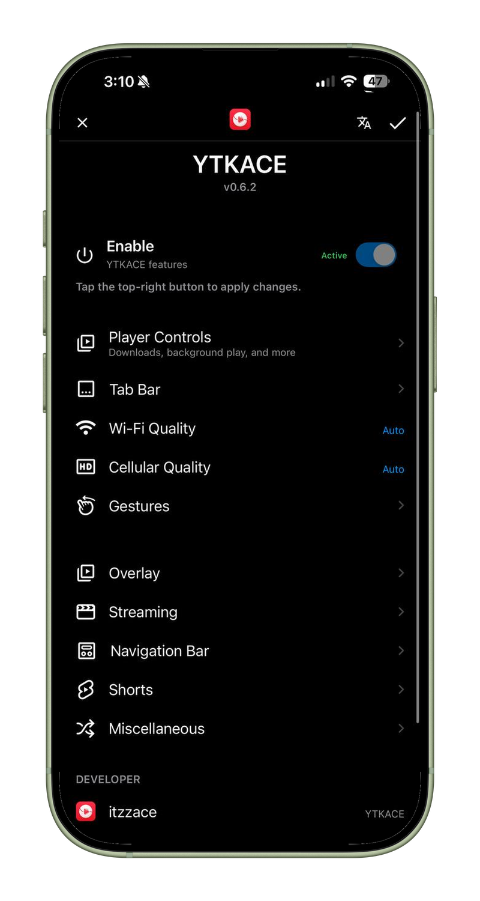
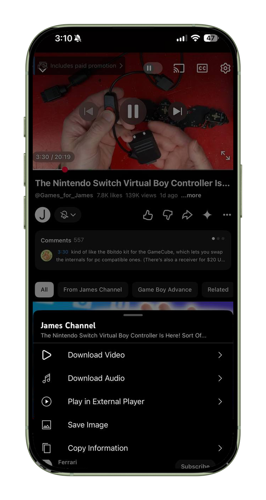
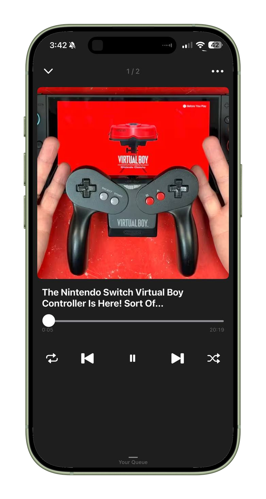
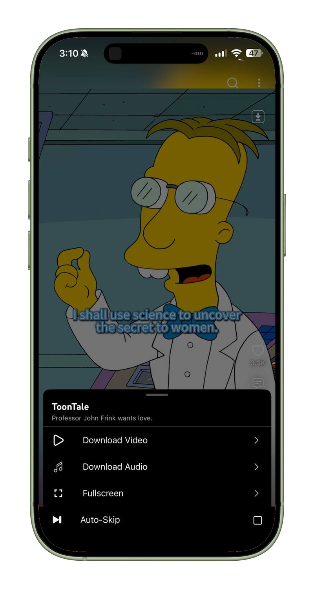
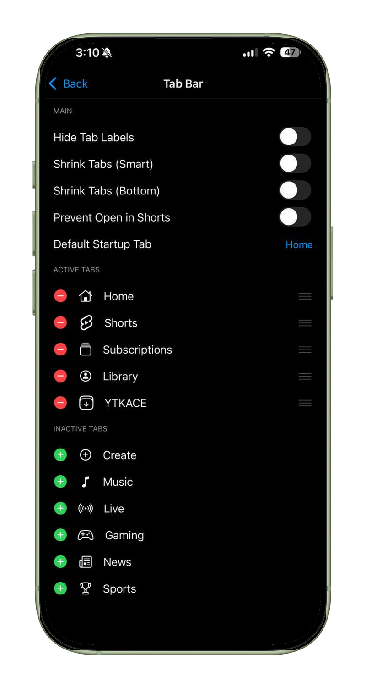
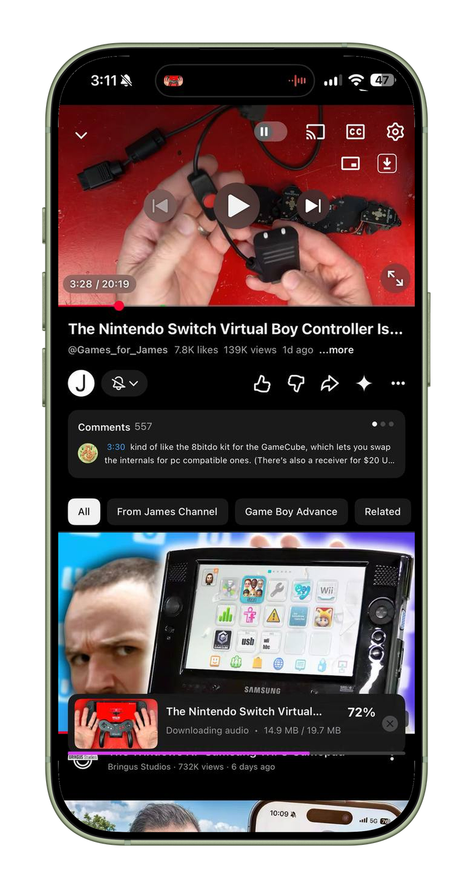
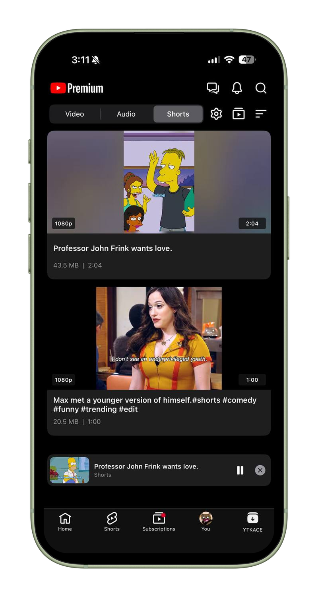
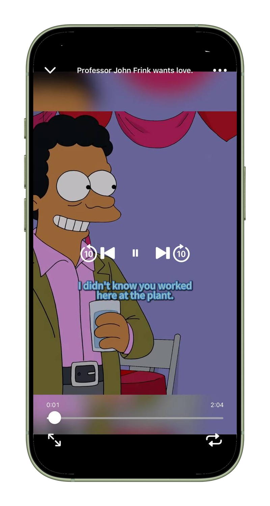
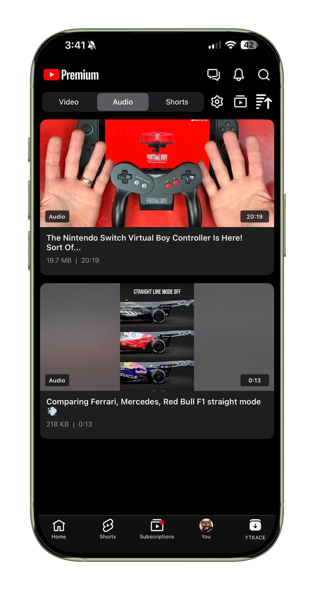
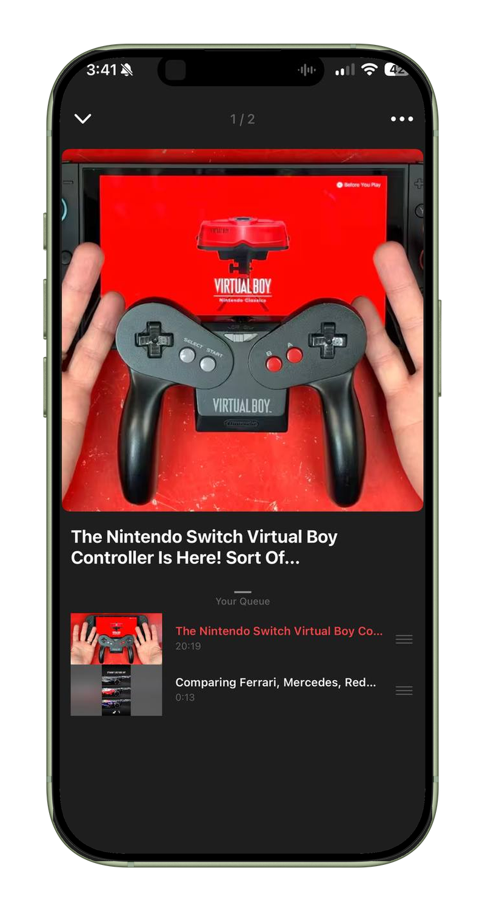

# YTKACE

A free and open-source YouTube enhancer for iOS with downloads, SponsorBlock, player controls, and interface customization.

## Table of Contents

- [Screenshots](#screenshots)
- [Main Features](#main-features)
- [Compatibility](#compatibility)
- [Installation](#installation)
- [Build with GitHub Actions](#build-with-github-actions)
- [FAQ](#faq)
- [License](#license)

## Screenshots

  
  
  

  Settings · Downloads · Audio Player

  
More screenshots

   
  

    
    
    
  

  

    
    
    
  

  

    
  

## Main Features

- Download videos, audio, and Shorts with quality and audio-track selection
- Built-in download manager with thumbnails, multiple layouts, sorting, queue, and mini-player
- Custom video and audio players for downloaded media
- Built-in SponsorBlock with markers, automatic skipping, and Ask mode
- Background playback, Picture in Picture, loop, playback speed, and custom gestures
- OLED mode, Premium logo, and player interface customization
- Hide, rename, and reorder tabs with a custom startup tab
- Hide comments, overlays, navigation items, Shorts elements, and other YouTube UI
- Wi-Fi and cellular quality preferences
- Cast compatibility and sideload fixes
- Copy comments and video information
- No activation, telemetry, or update checks

**YTKACE preferences can be found by opening the YTKACE tab and tapping the gear icon.**

See the full [feature matrix](docs/FEATURE_MATRIX.md).

## Compatibility

- **iOS:** 16.0 and newer
- **Architecture:** arm64
- **Latest confirmed YouTube:** 21.29.3
- **YTKACE:** 0.6.6

The same injected IPA can be installed with TrollStore, an AppSync-compatible installer, or a developer-certificate sideloader.

YTKACE does not require CydiaSubstrate, MobileSubstrate, Cephei, libhooker, or ElleKit.

## Installation

Download the latest build from [Releases](https://github.com/Epic0001/YTKACE/releases/latest), then install it with your preferred IPA installer.

> [!NOTE]
> YTKACE does not include YouTube. You are responsible for supplying and using a decrypted YouTube IPA that you are legally allowed to use.

## Build with GitHub Actions

> [!NOTE]
> If this is your first time, fork this repository and enable Actions in your fork.

  
How to build the YTKACE app

  <ol>
    <li>Open the <strong>Actions</strong> tab in your fork.</li>
    <li>Select <strong>IPA</strong>.</li>
    <li>Press <strong>Run workflow</strong>.</li>
    <li>Paste a direct download link to your decrypted YouTube IPA.</li>
    <li>Start the workflow and wait for it to finish.</li>
    <li>Download <strong>YTKACE-IPA</strong> from the finished run.</li>
  </ol>

The URL must point directly to the IPA file, not a download page.

To build only the tweak package, run the **Deb** workflow. It produces the `.deb` as a workflow artifact.

## FAQ

  
Where are the settings?

  
Open the YTKACE tab and tap the gear icon.

  
Does it work without a jailbreak?

  
Yes. Inject the tweak into a decrypted YouTube IPA, then sign it with TrollStore or a sideloading service.

  
Does YTKACE use YTKPlus?

  
No. YTKACE is an independent clean-room implementation and does not load or ship YTKPlus.

  
Can a YouTube update break features?

  
Yes. YouTube uses private classes that can change between releases. The latest confirmed version is listed above.

## License

YTKACE is available under the [MIT License](LICENSE).

Bundled FFmpeg libraries remain covered by their respective LGPL licenses.
